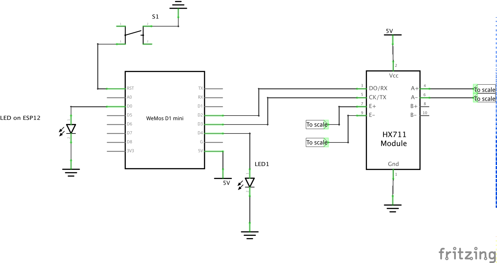

# WifiScale

I added an ESP8266 to a cheap digital scale, which together with the HX711 analog-to-digital converter, can read the load cells inside the scale. 

The ESP then uploads the results to an Google Sheets document. 

I make use of [@electronicsguy](https://github.com/electronicsguy)'s library [HTTPSRedirect](https://github.com/electronicsguy/ESP8266/tree/master/HTTPSRedirect), which makes it possible to send data to various Google Webservices without and 3rd party services (like IFTTT and similar).

# Usage
1. Press the button to wake the ESP from deep sleep.
2. The ESP connects to wifi and waits 

# Hardware
The schematic is shown below. The "most difficult" part is figuring out where the `E+/-` and `A+/-` cables need to be hooked up inside the scale. Thankfully, these are typically labeled on the PCB inside the scale.  The `A` might be replaced with `S`, meaning `Sense` (`E` is for `Emitter`).

# Requirements
**HX711 Arduino Library**, which can be downloaded in the Arduino IDE (`Sketch ➜  Include Library ➜ Manage Libraries`).

**HTTPSRedirect**, which can be downloaded [here](https://github.com/electronicsguy/ESP8266/tree/master/HTTPSRedirect). Place `HTTPSRedirect.cpp/h` and `DebugMacros.h` in WifiScale directory, next to the `.ino` file.

# Setup 
In order to make this work, you need to change all relevant parameters in the `.ino` file in the WifiScale director. These are wifi credentials, but also a google script id. 

The best way to understand this is to follow the instructions [here](https://github.com/electronicsguy/ESP8266/tree/master/HTTPSRedirect#sec-iv-working-example-using-google-docs).

**Good luck!**

